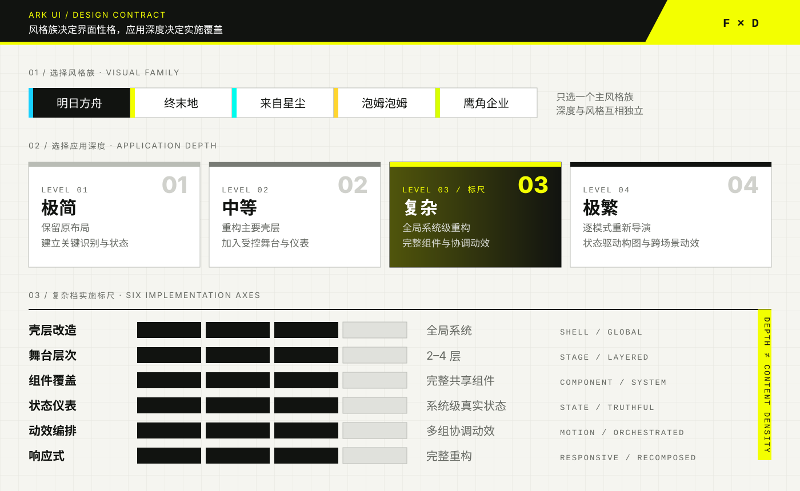

# Ark UI 使用说明

Ark UI 是一套基于公开设计证据、采用 clean-room 方法实现的界面设计与前端工作流。它支持两个互相独立的选择轴：

1. **风格族**：`ark`、`endfield`、`exa`、`popucom`、`corporate`。
2. **应用深度**：`minimal`、`moderate`、`complex`、`maximal`。

本项目不是相关游戏或厂商的官方项目，不包含受保护的标志、角色立绘、宣传图或生产环境代码。风格族只用于描述从公开页面归纳出的构图、色彩、排版、几何和动效规律。



上图是这套技能的设计契约：先选择一个风格族，再独立选择实施深度。深度衡量的是壳层、舞台、组件、状态、动效与响应式的覆盖程度，不是页面中堆放了多少内容。

## 安装

使用 Git 克隆到 Codex 技能目录：

```bash
git clone https://github.com/Brandon030722/ark-ui-skill.git "$CODEX_HOME/skills/ark-ui"
```

已经存在旧版本时，先备份自己的改动，再在该目录执行 `git pull`。安装后可直接在任务中写 `$ark-ui` 调用。

## 宣传素材

仓库内包含一组由真实样例界面编排的宣传图，提供 1600×900 横版和 1080×1350 竖版两种比例：


完整素材位于 `assets/promo/output/`，可编辑源文件位于 `assets/promo/`。重新生成全部八张图片：

```bash
node "$CODEX_HOME/skills/ark-ui/scripts/capture-promos.mjs"
```

## 五种风格族

| 键名 | 风格定位 | 视觉特征 | 适合场景 |
|---|---|---|---|
| `ark` | 工业信息系统 | 近黑与白为主体，青色信号，直线导轨、方形控件和斜向切口 | 战术面板、运营控制台、媒体门户、游戏菜单 |
| `endfield` | 现场工程系统 | 米白与炭黑为主体，信号黄强调，分区舞台、长引导线、校准刻度和大型编号 | 建设、物流、数据工具、工业产品和高对比技术界面 |
| `exa` | 宇宙档案系统 | 午夜蓝黑、白色与水青色，衬线标题、圆形仪表、轨道细线和星图节点 | 叙事档案、文化编辑、天文工具、角色资料和沉浸式产品页 |
| `popucom` | 明快协作系统 | 蓝、黄、橙与暖白，圆角胶囊、粗描边、错位阴影和轻快反馈 | 协作工具、趣味引导、家庭向游戏、活动页和启动流程 |
| `corporate` | 克制的工作室系统 | 黑白灰为主体，酸性黄绿色点缀，干净矩形、单色媒体和安静过渡 | 作品集、招聘页、工作室介绍和媒体展示 |

优先根据产品任务选择风格族，而不是只按喜欢的颜色选择。默认只使用一个主风格族；确需混合时最多组合两个，由主风格控制壳层、排版和主要色彩，次风格只提供一种受控的仪表、强调色或插画行为。

风格族决定界面的视觉性格，应用深度决定这种性格覆盖到什么程度。例如，`endfield + minimal` 与 `endfield + maximal` 使用同一种设计语言，但前者只调整基础识别层，后者会重构整套舞台、状态和动效系统。

## 四档深度

| 等级 | 键名 | 中文 | 适用目标 |
|---|---|---|---|
| 1 | `minimal` | 极简 | 保留原布局，只建立字体、色彩、几何和关键状态识别 |
| 2 | `moderate` | 中等 | 重构壳层并增加一组受控背景/仪表系统 |
| 3 | `complex` | 复杂 | 全局系统级重构，多区域壳层、分层舞台、完整组件覆盖与协调动效 |
| 4 | `maximal` | 极繁 | 展示级逐屏编排、状态驱动仪表、响应式重新导演与完整动效系统 |

第 3 档“复杂”的参考标准是系统级重构：覆盖顶栏、侧栏、主舞台、输入区、弹窗、代码或数据区域、焦点和状态反馈，并协调网格、斜向分区、校准圆、刻度轨和大型编号。只有进一步做到主要页面独立艺术编排、真实状态驱动构图、跨页面动效与性能降级方案时，才属于第 4 档“极繁”。

## 调用示例

```text
使用 $ark-ui，以 endfield 风格、2 级中等深度重构这个后台。
```

```text
使用 $ark-ui，把这个游戏启动器做成 ark + complex；保留现有信息架构。
```

```text
使用 $ark-ui，做 exa + maximal 的展示页，但正文阅读区最多保持 moderate。
```

如果没有指定深度，技能默认：生产力/产品界面使用 `moderate`，游戏邻接或展示型界面使用 `complex`，并在动手前说明假设。

## 代码约定

静态页面使用根属性：

```html
<html data-ark-theme="endfield" data-ark-depth="complex">
```

React 使用：

```jsx
<ArkShell theme="endfield" depth="complex" />
```

风格控制色彩、字体、几何和动效性格；深度控制壳层改造、舞台层数、组件覆盖、状态仪表、动效编排和响应式重构。深度增加不等于增加假数据、随机 HUD、额外颜色或无意义动画。

## 主要文件

- `SKILL.md`：核心工作流与触发规则。
- `references/depth-levels.md`：完整四档规范、第 3 档参考标尺和验收维度。
- `references/design-language.md`：共享视觉语法。
- `references/recipes.md`：五种风格族配方。
- `references/family-depth-matrix.md`：每个风格族在四档深度下的壳层、内容和仪表规则。
- `assets/starter-vanilla/`：带风格与深度选择器的原生 HTML/CSS/JS 示例。
- `assets/react/`：带 `theme` 与 `depth` 接口的 React 组件。
- `assets/showcases/`：五个风格族的独立可运行样例。
- `assets/promo/`：可编辑的宣传图源文件与横竖版 PNG 成品。
- `assets/tokens/ark-ui.tokens.json`：风格和深度配置参考。

## 验证

```bash
node "$CODEX_HOME/skills/ark-ui/scripts/audit-ark-ui.mjs" <html-or-css-path>
node "$CODEX_HOME/skills/ark-ui/scripts/capture-showcases.mjs" --mobile
python3 "$CODEX_HOME/skills/.system/skill-creator/scripts/quick_validate.py" "$CODEX_HOME/skills/ark-ui"
```

截图脚本默认以 1440×900 重建五张复杂档样例；`--mobile` 会同时以真实 390×844 设备视口复验，并在出现横向溢出时返回失败。四档深度都必须保持真实数据、清晰主任务、键盘可用、可见焦点、可读对比度、响应式布局和 `prefers-reduced-motion`。
